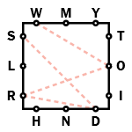

Letter Boxed is a word puzzle in the New York Times games section.

How to play Letter Boxed

Create words using letters round the square

* Connect letters to spell words
* Words must be at least 3 letters long
* Consecutive letters cannot be from the same side
* The last letter of a word becomes the first letter of the next word eg. THY > YES > SINCE
* Words cannot be proper nouns or hyphenated
* No cussing either, sorry
* Use all letters to solve!

https://www.nytimes.com/puzzles/letter-boxed

LetterBoxedSolverNYT parses NYT Letter Boxed metadata to extract valid words in today's Letter Boxed and finds a solution to a Letter Boxed game of shortest possible length.
